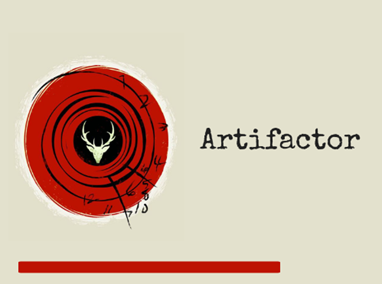
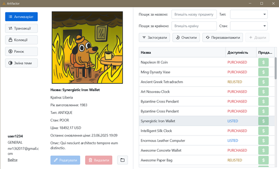
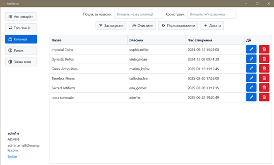
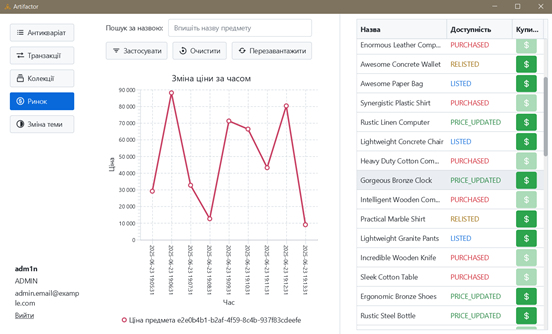

# Antique & Coin Collection Manager

> ⚠️ **Language notice**: the application interface supports **Ukrainian only**.

A local desktop application for managing personal collections of antiques and coins.  
Built as a college project using **Java**, **JavaFX**, and a **relational database**.

The app helps collectors keep accurate records, store images, track item condition, and monitor changes in market value over time.

---

## Features

- Create, view, update, and delete collection items (CRUD)
- Store detailed descriptions and photos
- Track item condition and estimated market value
- Filter, sort, and search within the collection
- Visualize price changes for selected items
- Intuitive JavaFX-based user interface
- Local data storage using a relational database

---

## Screenshots

### Loading Screen

### Authentication

### Antiques Store View

### Collection View

### Price Change Diagram

---

## How to Use

1. **Launch the application**
   - Start the Java application locally.

2. **Authenticate**
   - Log in or register using the authentication screen.

3. **Browse items**
   - View available antiques and coins.
   - Use filters and search to quickly find items.

4. **Manage your collection**
   - Add new items with descriptions, images, condition, and price.
   - Edit or remove existing items.

5. **Track value changes**
   - Select an item to view a diagram showing how its price changes over time.

---

## Technical Details

- **Language:** Java  
- **UI:** JavaFX  
- **Database:** H2 Relational (local)  
- **Platform:** Desktop application  

---

## Project Scope

- Developed within **3.5 months**
- Focused on reliability, clarity, and ease of use
- Intended for educational and personal collection management purposes

---

